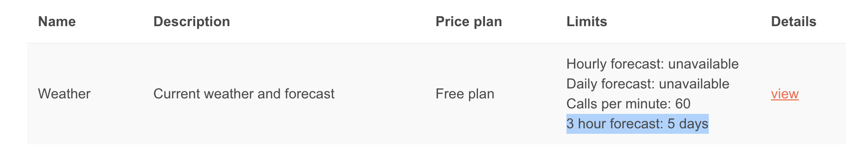

# Weather App
This is a Spring Boot application that provides weather information for a given city and country. It uses the OpenWeatherMap API to fetch weather data and implements rate limiting to prevent abuse.

## Features
- Get weather description for a city and country

- Input validation for city, country, and API key

- Rate limiting to prevent excessive API calls


## Key Notes 



1. The API keys used in this application are from the free tier, and the weather data fetched with the free plan related APIs.

2. The open weather data does refresh for every 10 mins. If a request is made for the same country and city, the data is served from cached data.

3. OpenWeather API requires country codes as input, making it challenging for users to know appropriate country codes https://en.wikipedia.org/wiki/List_of_ISO_3166_country_codes. This has been simplified with the help of Java(https://docs.oracle.com/javase/9/docs/api/java/util/Locale.IsoCountryCode.html.), and the API now expects the country name as input


## Technologies Used
- Java 17

- Spring Boot

- OpenWeatherMap API

- Bucket4j (for rate limiting)

- H2 Database

## Getting Started

### Prerequisites
- Java 17 or higher

- Gradle

### Installation
1. Clone the repository:
```text
git clone https://github.com/your-username/weather-app.git
```

2. Navigate to the project directory:
```text
    cd weather-app
```


### Configuration
1. Obtain an API key from OpenWeatherMap.

2. Set the following environment variables:

 - OPEN_WEATHER_MAP_API_KEY
: Your OpenWeatherMap API key

- RATE_LIMIT_REFILL_PERIOD_SECONDS
: Rate limit refill period in seconds (e.g., 60)

- RATE_LIMIT_BUCKET_SIZE
: Rate limit bucket size (e.g., 10)


### Building the Project
To build the project, run the following Gradle command:

```text
./gradlew build
```

This command will compile the source code, run the tests, and create a JAR file in the
build/libs directory.

### Running the Application
To run the application, execute the following Gradle command:

```text
./gradlew bootRun
```
This command will start the Spring Boot application.

2. Alternatively, you can run the JAR file directly:
```text 
java -jar build/libs/weather-app-0.0.1-SNAPSHOT.jar
```
Replace 0.0.1-SNAPSHOT with the actual version of your application.

3. The application will be available at http://localhost:8080.

### Usage
To get the weather description for a city and country, send a GET request to the following endpoint:
```text
http://localhost:8080/weather?city=London&country=United%20Kingdom&apiKey=YOUR_API_KEY
```


## Acknowledgments
OpenWeatherMap for providing the weather data API

Bucket4j for the rate limiting implementation

